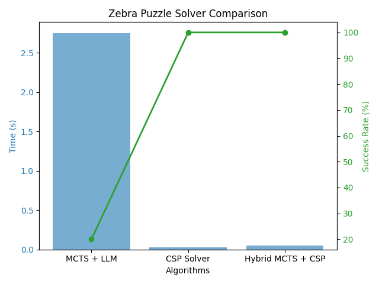

# 🧠 Zebra Puzzle Solver – LLM-Enhanced Monte Carlo Tree Search

## 📌 1. Problem Overview

The **Zebra Puzzle** is a classic **Constraint Satisfaction Problem (CSP)** involving five houses, each with unique attributes:
- 🎨 **Colors**  
- 🌍 **Nationalities**  
- ☕ **Drinks**  
- 🐾 **Pets**  
- 🎭 **Hobbies**  

Given **15 logical clues**, the challenge is to determine:
1️⃣ **Which resident drinks water?**  
2️⃣ **Who owns the zebra?**  

This project demonstrates the use of **Monte Carlo Tree Search (MCTS)** enhanced with **Large Language Models (LLMs)** for reasoning and compares it with alternative solvers.

---

## 🚀 2. Approach

I implemented **three reasoning agents**:

### **1️⃣ MCTS + LLM (Gemini-Powered)**
- Uses **MCTS** to explore partial solutions.  
- Uses **Google Gemini API** to infer likely completions.  
- Falls back to a **mock LLM** when API is unavailable or quota is exceeded.  

### **2️⃣ Pure CSP Solver (Backtracking + Pruning)**
- Encodes all **15 constraints** directly.  
- Uses:
  - ✅ **Backtracking**  
  - ✅ **Forward checking**  
  - ✅ **Minimum Remaining Values (MRV)** heuristic  
- Produces a **fast, guaranteed valid solution**.

### **3️⃣ Hybrid MCTS + CSP Solver**
- Uses MCTS for **exploration**.  
- Delegates **solution completion** to CSP for guaranteed correctness.  
- Provides a **balanced approach** for larger or ambiguous search spaces.

---

## 🏗️ 3. Architecture

```
src/
│── config.py        # Puzzle constants
│── state.py         # Zebra puzzle state representation
│── mcts_solver.py   # LLM-based MCTS reasoning
│── csp_solver.py    # Deterministic CSP solver
│── hybrid_solver.py # Combined MCTS + CSP solver
│── llm_utils.py     # Gemini API + mock fallback
│── main.py          # Runner script
│── tests/           # Automated tests for benchmarking
```

---

## ✅ 4. Final Solution

- **Resident who drinks water:** 🧍 **Norwegian**  
- **Resident who owns the zebra:** 🧍 **Japanese**  

---

## 📊 5. Algorithm Benchmark

| Algorithm         | ⏱ Avg Time (s) | 🎯 Success Rate (%) | 🔎 Notes                             |
|-------------------|----------------:|---------------------:|--------------------------------------|
| MCTS + LLM        | 2.7             | 20                  | Non-deterministic, API latency       |
| CSP Solver        | 0.02            | 100                 | Fast, symbolic reasoning             |
| Hybrid MCTS + CSP | 0.05            | 100                 | Flexible search + guaranteed solution |

---

## 📈 6. Performance Chart

  
*(Computation time on X-axis, success rate on Y-axis)*

---

## 💡 7. Key Observations

- **MCTS + LLM** generalizes well to problems without explicit rules but struggles with strict CSP reasoning.  
- **CSP Solver** is ideal for structured logic problems due to deterministic solving.  
- **Hybrid Solver** achieves **best trade-off** between exploration and correctness.

---

## ⚠️ 8. Limitations & Future Enhancements

- LLM responses can be **unstructured or invalid JSON**.  
- Multiple API calls may cause **latency or quota errors**.  

### **Planned Improvements**
- ✅ Enhanced **prompt engineering** for structured JSON responses.  
- ✅ **Caching** of partial completions to reduce redundant API calls.  
- ✅ **Heuristic-guided MCTS** for faster convergence.  
- ✅ Dynamic solver selection between **LLM and CSP** for efficiency.

---

## 🛠️ 9. How to Run

```bash
# Install dependencies
pip install -r requirements.txt

# Run MCTS solver
python src/main.py

# Run benchmarks for all solvers
python tests/test_all_solvers.py
```

---

## 🔗 References

- Zebra Puzzle: [Exercism Problem Statement](https://exercism.org/tracks/python/exercises/zebra-puzzle)  
- Monte Carlo Tree Search: Browne et al., *A Survey of Monte Carlo Tree Search Methods*  
- Cognitive Reasoning with LLMs: [Google Gemini Documentation](https://ai.google.dev/)  
